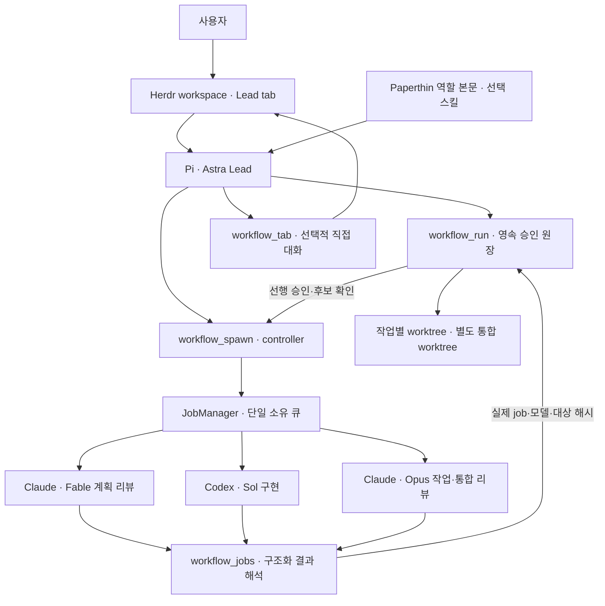

# 통합 구조

모델과 실행 환경을 구분한다. Pi는 Astra Lead를 실행하고, 패키지가 Codex·Claude CLI 자식을 관리하며, Herdr는 사용자의 터미널·직접 상호작용을 담당한다.

## 소유권

| 구성 | 담당 |
| --- | --- |
| `extensions/workflow.ts` | Pi 명령·도구, 활성화, 세션 정리 |
| `lib/runtime.mjs` | 프로젝트 설정, 역할 본문, CLI 인자 |
| `lib/routing.mjs` | 단계별 profile, Fable 정책, 구조화 리뷰·모델·사용량 해석 |
| `lib/controller.mjs` | 승인 원장과 실행 job의 연결, 실패 시 소유 job 취소 |
| `lib/jobs.mjs` | 동시성·큐·timeout·로그·프로세스 그룹 수명 |
| `lib/workflow-state.mjs` | 계획/후보 승인, worktree·파일 소유권, 의존성, 검사, 복구·통합 |
| `lib/herdr.mjs` | Herdr 내부에서 명시한 workspace의 새 대화형 탭 |
| `lib/metrics.mjs` | 보고된 실행 시간·토큰·비용의 단계/profile별 집계 |

Astra만 전체 반복을 소유한다. `re0-loop`나 `sip`는 이 반복 안에서 수행하는 절차이며 별도 scheduler를 만들지 않는다. 모델의 판단이 필요한 부분은 리뷰 내용과 실제 검증의 적절성이다. 코드는 작업 식별자·해시·상태·검사 결과의 일치를 검사한다.

## 두 종류의 독립 읽기

- `shower`: 실제 전달한 산출물 내용만 보는 이해도 검사. 도구·이웃 파일·작성자 대화 없이 실행한다.
- 계획/코드 리뷰: 요구사항과 관련 저장소 근거를 읽어 타당성과 회귀 위험을 판단한다. 구조화된 verdict가 정확한 계획·후보 해시와 일치해야 한다.

## 기록과 복구

승인 원장은 Git common directory에 있어 같은 저장소의 worktree들이 하나의 상태를 공유한다. 한 controller만 이를 소유하며, 로그와 partial worktree는 재시작 후에도 보존한다. 프로세스 재접속·자동 재시작은 하지 않는다. 이전 controller가 끝났을 때 미정산 작업은 blocked로 남고 실제 로그·부분 변경을 확인한 명시적 recover가 필요하다.

검사와 worktree 생성은 실행 전에 원장에 예약한다. 후보 검사는 비동기로 실행하며, 세션 종료는 검사 정리와 결과 저장을 기다린다. 중단된 worktree 생성은 저장된 경로·저장소·기준 SHA를 확인하는 복구 절차로 마무리한다.

작업 후보와 통합 후보는 각각 검사와 Opus 리뷰를 통과해야 한다. 최종 candidate는 별도 통합 worktree에서 반환된다. 사용자 브랜치에 반영하는 Git 작업은 Lead가 실제 권한·기존 변경을 확인해 수행한다.

[실행 도구와 JSON 계약](orchestration.md) · [운영 및 실패 복구](../RUNBOOK.md)
