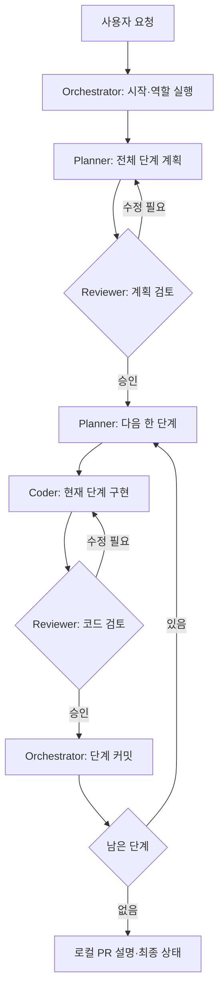

# 참조 워크플로우와 현재 구성

참조: [Jackliu-miaozi/pi-herdr-workflow-kit](https://github.com/Jackliu-miaozi/pi-herdr-workflow-kit), 검토 기준 커밋 `3d5600b1ab6ceb19049724fd54cb001699324547`.

참조 킷의 설계를 읽고 역할·계획 검토·단계별 검증 방식을 참고했다. 해당 저장소의 설치 스크립트를 실행하거나 코드를 복사한 구성은 아니다.

## 참조 킷의 흐름

참조 킷은 Orchestrator, Planner, Coder, Reviewer를 별도 Pi 에이전트로 나눈다. Planner가 전체 계획과 한 단계의 작업 묶음을 작성하고 Reviewer가 계획·코드를 각각 검토한다. 승인된 단계의 커밋은 Orchestrator가 맡는다. [고정 버전 README](https://github.com/Jackliu-miaozi/pi-herdr-workflow-kit/blob/3d5600b1ab6ceb19049724fd54cb001699324547/README.md)

실질적인 인계는 `.pi-herdr/` 아래 작업 파일·결과물·프로젝트 메모리에 저장하고, 터미널 마커는 진행 확인에 사용한다. 마지막 산출물은 로컬 PR 설명이며 원격 push나 PR 생성을 자동 수행하지 않는다. [고정 버전 workflow 문서](https://github.com/Jackliu-miaozi/pi-herdr-workflow-kit/blob/3d5600b1ab6ceb19049724fd54cb001699324547/docs/workflow.md)

## 문서상의 절차와 코드의 보장

참조 킷은 상태 파일과 `workflow_start`, `agent_*`, `git_phase_commit` 도구를 제공한다. 그러나 승인 순서를 강제하는 상태 전이 엔진으로 보기는 어렵다. 예를 들어 `git_phase_commit`은 승인 기록을 검증하지 않고 `git add -A` 후 커밋하며, 상태 갱신 도구도 다음 단계의 승인 조건을 강제하지 않는다. 따라서 “승인 후 커밋”은 역할 지침을 따르는 Orchestrator의 책임이다. [커밋 도구](https://github.com/Jackliu-miaozi/pi-herdr-workflow-kit/blob/3d5600b1ab6ceb19049724fd54cb001699324547/extension/pi-herdr-agents.ts#L847), [상태 갱신](https://github.com/Jackliu-miaozi/pi-herdr-workflow-kit/blob/3d5600b1ab6ceb19049724fd54cb001699324547/extension/pi-herdr-agents.ts#L1114)

완료 마커에는 작업 식별자가 없으므로 마커만으로 현재 작업이 승인됐다고 판정하지 않아야 한다. 실제 결과물·작업 범위·Git 상태를 함께 확인하는 운영 규칙이 필요하다. 이 판단은 문서의 마커 정의와 역할 간 전달 구현을 바탕으로 한 해석이다. [마커 정의](https://github.com/Jackliu-miaozi/pi-herdr-workflow-kit/blob/3d5600b1ab6ceb19049724fd54cb001699324547/docs/workflow.md#markers), [에이전트 전달 도구](https://github.com/Jackliu-miaozi/pi-herdr-workflow-kit/blob/3d5600b1ab6ceb19049724fd54cb001699324547/extension/pi-herdr-agents.ts#L721)

참조 설치기는 사용자 전역에 역할 wrapper·확장·스킬을 복사하며 기본 provider/model은 DeepSeek/Flash다. 역할 실행이 Pi를 전제로 하므로 모델 이름만 Claude로 바꿔 Claude Code Reviewer를 얻는 구조는 아니다. [설치기 기본값](https://github.com/Jackliu-miaozi/pi-herdr-workflow-kit/blob/3d5600b1ab6ceb19049724fd54cb001699324547/scripts/install.sh#L6), [역할 구성](https://github.com/Jackliu-miaozi/pi-herdr-workflow-kit/blob/3d5600b1ab6ceb19049724fd54cb001699324547/scripts/install.sh#L59)

## 이 패키지의 선택

| 항목 | 참조 킷 | Pi Paperthin Orchestration |
| --- | --- | --- |
| 계획과 조율 | 별도 Planner·Orchestrator | Lead/Astra가 함께 담당 |
| 구현 | Pi Coder | 작업별 sol/fable/codex profile |
| 검토·분석 | Pi Reviewer | opus/fable profile, 수정 없는 결과 반환 |
| 기본 위임 | Herdr의 에이전트 pane | pane 없는 독립 headless 프로세스 |
| 프로세스 관리 | 킷 자체 agent 도구·상태 | Lead가 소유한 bounded queue·취소·보존된 출력 |
| 시작 | pi-orchestrator와 프롬프트 | 일반 Pi에서 `/lead <요청>` |
| Paperthin | 킷 역할 지침과 선택 스킬 | 28개 catalog, 역할 핵심·선택 본문, invocation 구분 |
| 프로젝트 설정 | 킷 생성 설정 | 대상 `.pi/paperthin.json`의 roles·routing·jobs |

현재 흐름은 Lead의 요청 해석·작업 규모 평가 → 계획 정리·해시 고정·계획 리뷰 → 첫 Worker 브리프의 독립 읽기 → 구현 → 필요한 sip 검사·수정 → 후보 고정·코드 리뷰 → 통합·학습이다. `modelchk`는 중립 추천을 만들고 executor가 허용된 profile과 실제 effort를 선택한다. 사용자 pin이 우선하며 인증·접근 실패를 자동 fallback으로 감추지 않는다.

Lead만 `workflow_spawn`·`workflow_jobs`를 사용해 작업을 배정하고 회수한다. 기본 동시 실행은 2개, 대기는 8개, 작업 실행 제한은 15분이다. `workflow_cold_read`도 같은 queue에서 내용만 읽고 해시·독립 해석을 돌려준다. `sip`·`re0-loop` 등은 Lead의 기존 반복에 통합하며 자식이 별도 scheduler를 만들지 않는다. 상세 계약은 [orchestration.md](orchestration.md)를 따른다.

Herdr는 프로젝트 workspace와 Lead tab의 화면 구성에 사용한다. 상호작용이 필요한 작업만 수동 task tab으로 운영한다. 기존 `workflow_prepare`·pi-herdr pane 위임은 호환 경로이며 현재 pi-herdr 0.5의 `split --current` 동작을 task tab 자동 배치로 해석하지 않는다. 패키지에는 task tab 자동 어댑터가 없다.

scheduler의 완료는 프로세스 종료이며 품질 승인과 다르다. 계획·코드 리뷰 순서와 Paperthin 적용은 여전히 Lead의 판단과 근거 확인이 필요하다. 코드가 승인 전이를 모두 강제하거나 새 세션에서 프로세스를 자동 재개하는 구조는 아니다. 실제 후보 SHA·diff·테스트·외부 근거를 확인하며, 고정·승인 뒤 바뀐 대상은 새 해시로 영향받는 리뷰를 다시 받는다.
