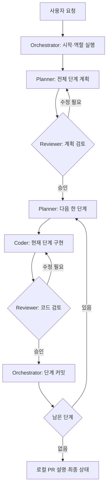

# 참조 워크플로우와 현재 구성

참조: [Jackliu-miaozi/pi-herdr-workflow-kit](https://github.com/Jackliu-miaozi/pi-herdr-workflow-kit), 검토 기준 커밋 `3d5600b1ab6ceb19049724fd54cb001699324547`.

참조 킷의 설계를 읽고 역할·계획 검토·단계별 검증 방식을 참고했다. 해당 저장소의 설치 스크립트를 실행하거나 코드를 복사한 구성은 아니다.

## 참조 킷의 흐름

참조 킷은 Orchestrator, Planner, Coder, Reviewer를 별도 Pi 에이전트로 나눈다. Planner가 전체 계획과 한 단계의 작업 묶음을 작성하고 Reviewer가 계획·코드를 각각 검토한다. 승인된 단계의 커밋은 Orchestrator가 맡는다. [고정 버전 README](https://github.com/Jackliu-miaozi/pi-herdr-workflow-kit/blob/3d5600b1ab6ceb19049724fd54cb001699324547/README.md)

실질적인 인계는 `.pi-herdr/` 아래 작업 파일·결과물·프로젝트 메모리에 저장하고, 터미널 마커는 진행 확인에 사용한다. 마지막 산출물은 로컬 PR 설명이며 원격 push나 PR 생성을 자동 수행하지 않는다. [고정 버전 workflow 문서](https://github.com/Jackliu-miaozi/pi-herdr-workflow-kit/blob/3d5600b1ab6ceb19049724fd54cb001699324547/docs/workflow.md)

## 문서상의 절차와 코드의 보장

참조 킷은 상태 파일과 `workflow_start`, `agent_*`, `git_phase_commit` 도구를 제공한다. 그러나 승인 순서를 강제하는 상태 전이 엔진으로 보기는 어렵다. 예를 들어 `git_phase_commit`은 승인 기록을 검증하지 않고 `git add -A` 후 커밋하며, 상태 갱신 도구도 다음 단계의 승인 조건을 강제하지 않는다. 따라서 “승인 후 커밋”은 역할 지침을 따르는 Orchestrator의 책임이다. [커밋 도구](https://github.com/Jackliu-miaozi/pi-herdr-workflow-kit/blob/3d5600b1ab6ceb19049724fd54cb001699324547/extension/pi-herdr-agents.ts#L847), [상태 갱신](https://github.com/Jackliu-miaozi/pi-herdr-workflow-kit/blob/3d5600b1ab6ceb19049724fd54cb001699324547/extension/pi-herdr-agents.ts#L1114)

완료 마커에는 작업 식별자가 없으므로 마커만으로 현재 작업이 승인됐다고 판정하지 않아야 한다. 실제 결과물·작업 범위·Git 상태를 함께 확인하는 운영 규칙이 필요하다. 이 판단은 문서의 마커 정의와 역할 간 전달 구현을 바탕으로 한 해석이다. [마커 정의](https://github.com/Jackliu-miaozi/pi-herdr-workflow-kit/blob/3d5600b1ab6ceb19049724fd54cb001699324547/docs/workflow.md#markers), [에이전트 전달 도구](https://github.com/Jackliu-miaozi/pi-herdr-workflow-kit/blob/3d5600b1ab6ceb19049724fd54cb001699324547/extension/pi-herdr-agents.ts#L721)

참조 설치기는 사용자 전역에 역할 wrapper·확장·스킬을 복사하며 기본 provider/model은 DeepSeek/Flash다. 역할 실행이 Pi를 전제로 하므로 모델 이름만 Claude로 바꿔 Claude Code Reviewer를 얻는 구조는 아니다. [설치기 기본값](https://github.com/Jackliu-miaozi/pi-herdr-workflow-kit/blob/3d5600b1ab6ceb19049724fd54cb001699324547/scripts/install.sh#L6), [역할 구성](https://github.com/Jackliu-miaozi/pi-herdr-workflow-kit/blob/3d5600b1ab6ceb19049724fd54cb001699324547/scripts/install.sh#L59)

## 이 패키지의 선택

| 항목 | 참조 킷 | Pi Paperthin Orchestration |
| --- | --- | --- |
| 계획과 조율 | 별도 Planner·Orchestrator | Lead/Astra가 함께 담당 |
| 구현 | Pi Coder | Pi/Sol Worker, Codex Worker 선택 가능 |
| 검토 | Pi Reviewer | Claude Code/Opus, plan 모드에서 텍스트 반환 |
| 적용 범위 | 전역 파일·wrapper 설치 | Pi 패키지 설치 후 임의 프로젝트에서 활성화 |
| 시작 | pi-orchestrator와 작업 프롬프트 | 일반 Pi에서 `/lead <요청>` |
| Herdr 제어 | 자체 agent 도구 | 기존 pi-herdr 재사용 |
| 스킬 | 킷 역할 지침과 선택 스킬 | Paperthin readchk·modelchk·shower·re0 |
| 프로젝트 설정 | 킷의 생성 설정 | 대상 프로젝트 `.pi/paperthin.json` |

현재 기본 흐름은 Lead 계획 → Reviewer 계획 검토 → Worker의 단계 구현 → Reviewer 코드 검토 → Lead의 승인 범위 커밋·통합이다. 별도 Planner는 현재 기본 역할로 구현했다고 주장하지 않는다.

이 패키지도 반복 전체를 강제하는 상태 머신은 아니다. `/lead`가 정확한 모델과 역할 정책을 활성화하고, `workflow_prepare`가 실행 인자·브리프를 준비하면 Lead가 기존 `herdr_delegate`로 실행한다. 모델이 진행 순서를 판단한다.

공통 지침은 현재 후보 SHA와 테스트 근거 확인, 작업자별 worktree, 다른 변경 보존, 리뷰 도중 후보 고정, 불필요한 모델·API fallback 금지를 요구한다. 이 규칙은 에이전트의 행동 지침이며 파일 권한이나 승인 이력을 검증하는 전이 엔진과 동일하지 않다.

후속으로 승인·단계 전이를 코드에서 보장하려면 작업 ID, 검토 대상 SHA, 승인 증거, 허용 전이, 재시도·중단·재개 정책을 별도로 구현하고 검증해야 한다. 현재 제공 범위를 넘어선 기능이므로 설치 완료를 그 기능의 완성으로 해석하지 않는다.
