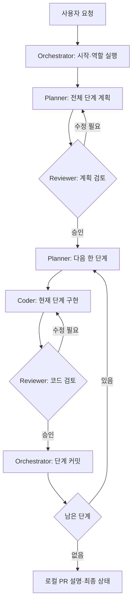

# 참조 워크플로우와 현재 구성

참조: [Jackliu-miaozi/pi-herdr-workflow-kit](https://github.com/Jackliu-miaozi/pi-herdr-workflow-kit), 검토 기준 커밋 `3d5600b1ab6ceb19049724fd54cb001699324547`.

참조 킷의 설계를 읽고 역할·계획 검토·단계별 검증 방식을 참고했다. 해당 저장소의 설치 스크립트를 실행하거나 코드를 복사한 구성은 아니다.

## 참조 킷의 흐름

참조 킷은 Orchestrator, Planner, Coder, Reviewer를 별도 Pi 에이전트로 나눈다. Planner가 전체 계획과 한 단계의 작업 묶음을 작성하고 Reviewer가 계획·코드를 각각 검토한다. 승인된 단계의 커밋은 Orchestrator가 맡는다. [고정 버전 README](https://github.com/Jackliu-miaozi/pi-herdr-workflow-kit/blob/3d5600b1ab6ceb19049724fd54cb001699324547/README.md)

실질적인 인계는 `.pi-herdr/` 아래 작업 파일·결과물·프로젝트 메모리에 저장하고, 터미널 마커는 진행 확인에 사용한다. 마지막 산출물은 로컬 PR 설명이며 원격 push나 PR 생성을 자동 수행하지 않는다. [고정 버전 workflow 문서](https://github.com/Jackliu-miaozi/pi-herdr-workflow-kit/blob/3d5600b1ab6ceb19049724fd54cb001699324547/docs/workflow.md)

## 문서상의 절차와 코드의 보장

참조 킷은 상태 파일과 `workflow_start`, `agent_*`, `git_phase_commit` 도구를 제공한다. 그러나 승인 순서를 강제하는 상태 전이 엔진으로 보기는 어렵다. 예를 들어 `git_phase_commit`은 승인 기록을 검증하지 않고 `git add -A` 후 커밋하며, 상태 갱신 도구도 다음 단계의 승인 조건을 강제하지 않는다. 따라서 “승인 후 커밋”은 역할 지침을 따르는 Orchestrator의 책임이다. [커밋 도구](https://github.com/Jackliu-miaozi/pi-herdr-workflow-kit/blob/3d5600b1ab6ceb19049724fd54cb001699324547/extension/pi-herdr-agents.ts#L847), [상태 갱신](https://github.com/Jackliu-miaozi/pi-herdr-workflow-kit/blob/3d5600b1ab6ceb19049724fd54cb001699324547/extension/pi-herdr-agents.ts#L1114)

완료 마커에는 작업 식별자가 없으므로 마커만으로 현재 작업이 승인됐다고 판정하지 않아야 한다. 실제 결과물·작업 범위·Git 상태를 함께 확인하는 운영 규칙이 필요하다. 이 판단은 문서의 마커 정의와 역할 간 전달 구현을 바탕으로 한 해석이다. [마커 정의](https://github.com/Jackliu-miaozi/pi-herdr-workflow-kit/blob/3d5600b1ab6ceb19049724fd54cb001699324547/docs/workflow.md#markers), [에이전트 전달 도구](https://github.com/Jackliu-miaozi/pi-herdr-workflow-kit/blob/3d5600b1ab6ceb19049724fd54cb001699324547/extension/pi-herdr-agents.ts#L721)

참조 설치기는 사용자 전역에 역할 wrapper·확장·스킬을 복사하며 기본 provider/model은 DeepSeek/Flash다. 역할 실행이 Pi를 전제로 하므로 모델 이름만 Claude로 바꿔 Claude Code Reviewer를 얻는 구조는 아니다. [설치기 기본값](https://github.com/Jackliu-miaozi/pi-herdr-workflow-kit/blob/3d5600b1ab6ceb19049724fd54cb001699324547/scripts/install.sh#L6), [역할 구성](https://github.com/Jackliu-miaozi/pi-herdr-workflow-kit/blob/3d5600b1ab6ceb19049724fd54cb001699324547/scripts/install.sh#L59)

## 이 패키지의 선택

| 항목 | 참조 킷 | Pi Paperthin Orchestration |
| --- | --- | --- |
| 계획과 조율 | 별도 Planner·Orchestrator | Pi/Astra Lead가 함께 담당 |
| 계획 리뷰 | Pi Reviewer | 기본 Claude/Fable, `plan_review` |
| 구현 | Pi Coder | 기본 Codex/Sol, `implement`; Pi/Sol 선택 가능 |
| 코드 리뷰 | Pi Reviewer | 기본 Claude/Opus, 작업·통합 `code_review` |
| 기본 위임 | Herdr의 에이전트 pane | 화면 없는 독립 프로세스·bounded queue |
| 승인 관리 | 역할 지침과 작업 기록 | 영속 원장·실제 job·모델·계획/후보 해시 대조 |
| 변경 격리 | 단계별 작업 절차 | 등록 worktree·담당 경로·의존성·별도 통합 후보 |
| 직접 대화 | Herdr 에이전트 도구 | 선택적 `workflow_tab`으로 새 탭·새 세션 |
| 시작 | pi-orchestrator와 프롬프트 | 일반 Pi에서 `/lead <요청>` |
| Paperthin | 킷 역할 지침과 선택 스킬 | 28개 catalog, 역할 핵심·선택 본문, invocation 구분 |
| 프로젝트 설정 | 킷 생성 설정 | 대상 `.pi/paperthin.json`의 roles·routing·jobs |

현재 흐름은 요청 해석·계획 정리 → 고정 계획의 Fable 리뷰 → 첫 Worker 브리프의 독립 읽기 → Codex/Sol 구현 → Lead 커밋·후보 고정·실제 검사 → Opus 작업 리뷰 → 별도 worktree 통합·검사·Opus 최종 리뷰 → 완료·학습이다. [전체 구조도](architecture.md)

`workflow_run`은 계획 스냅샷, 등록 worktree, 작업별 소유 경로·의존성, 후보와 검사를 관리한다. 구현·리뷰의 `workflow_spawn`에는 runId와 phase가 필요하며 실제 job 결과를 `workflow_jobs`로 회수해 승인 원장을 갱신한다. 현재 계획·후보의 선행 조건이 맞아야 다음 단계로 진행한다. 일반 `analyze`와 직접 대화 탭은 승인 경로와 별개다.

`modelchk`는 중립 추천을 만들고 executor가 사용자 pin·명시 profile·단계 기본값과 실제 effort를 적용한다. Fable headless의 usage credits는 기본 허용하지 않으며, 사용자 정책의 명시적 설정을 요구한다. 인증·접근 실패를 다른 모델이나 API 결제로 자동 우회하지 않는다.

Lead만 전체 작업을 조율한다. 기본 한도는 동시 2개·대기 8개·job당 15분이며 `workflow_cold_read`도 같은 큐에서 내용만 독립 읽는다. `sip`·`re0-loop`는 기존 반복에 통합하고 자식은 scheduler를 만들지 않는다. [상세 실행 계약](orchestration.md)

Herdr는 프로젝트 workspace와 Lead tab을 제공한다. 직접 상호작용이 필요하면 Herdr 내부의 `workflow_tab`이 명시한 workspace에 새 탭을 만들고 Pi·Codex·Claude의 별도 대화형 세션을 시작한다. 기존 headless job의 재개·이전이나 승인 등록 기능은 아니다. 기존 `workflow_prepare`·pi-herdr pane 위임은 호환 경로로 유지하며 현재 pane 분할을 task tab 생성으로 해석하지 않는다.

원장은 Git common directory에 보존하고 한 controller가 소유한다. 재시작 후에는 이전 기록·로그·부분 worktree를 확인하고 blocked 작업을 명시적으로 복구한다. 프로세스를 자동 재접속·재시작하거나 사용자 checkout을 덮어쓰지 않는다. 완료한 후보를 사용자 브랜치에 반영·push·PR 처리할 권한은 실제 사용자 요청에서 확인한다.

코드는 승인 대상과 실제 실행·검사 기록의 일치를 강제한다. 요구사항을 충분히 검증했는지와 리뷰 판단이 타당한지는 여전히 Lead와 Reviewer의 책임이다. Paperthin 본문 주입이나 프로세스 정상 종료는 그 증거를 대신하지 않는다. [운영·복구](../RUNBOOK.md) · [검증 범위](verification.md)
